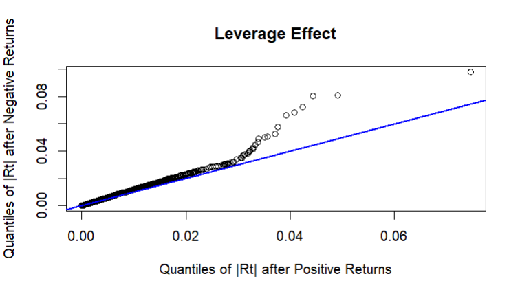

# FTSE 250 Volatility Modelling and Value-at-Risk Forecasting

**MA5639 Time Series Forecasting and Risk Modelling** · Brunel University London

ARMA–GARCH modelling of FTSE 250 daily log returns (29/01/2010 – 17/02/2023), comparing innovation distributions and asymmetric volatility specifications, then forecasting 24-hour $VaR_{0.01}$ over a 300-day horizon.

---

## Contents

1. [Summary of Results](#summary-of-results)
2. [Stationarity](#1-stationarity)
3. [Serial Dependence and Volatility Clustering](#2-serial-dependence-and-volatility-clustering)
4. [ARMA Model Selection (BIC)](#3-arma-model-selection-bic)
5. [Classical AR(1)–GARCH(1,1)](#4-classical-ar1garch11)
6. [Innovation Distribution Comparison](#5-innovation-distribution-comparison)
7. [Leverage Effect and Asymmetric Extensions](#6-leverage-effect-and-asymmetric-extensions)
8. [VaR and Volatility Forecasting](#7-var-and-volatility-forecasting)
9. [Requirements](#requirements)
10. [References](#references)

---

## Summary of Results

| Stage | Outcome |
|---|---|
| Stationarity | Prices non-stationary (ADF $p = 0.097$); log returns stationary (ADF $p \le 0.01$) |
| Mean equation | AR(1) selected by BIC |
| Best distribution (sGARCH) | Skewed Student-t (Bayes $= -6.6573$) |
| Leverage effect | $\text{corr}(R_t^2, R_{t-1}) = -0.114$ |
| **Final model** | **AR(1)–EGARCH(1,1), skewed Student-t** (Bayes $= -6.6889$) |
| Max 24h $VaR_{0.01}$ (£10,000) | **£232.65**, at day 3 |
| Long-run conditional volatility | $\approx 0.864\%$ per day |

---

## 1. Stationarity

Index prices exhibit a long-run trend, so log returns are used for modelling.

```r
plot(prices.dat, ylab = "Raw Price",
     main = "FTSE 250 Daily Prices")

plot(log.returns, ylab = "Log Returns",
     main = "FTSE 250 Daily Log Returns")

adf.test(as.numeric(prices.dat))
adf.test(log.numeric)
```

<p align="center">
  
  
</p>

| Series | ADF p-value | Conclusion (5%) |
|---|---|---|
| Raw prices | 0.09745 | Fail to reject unit root → non-stationary |
| Log returns | $\le 0.01$ | Reject unit root → stationary |

> `tseries::adf.test` truncates p-values at 0.01, so the true value is at most 0.01.

Raw prices do not fluctuate around a fixed mean. Log returns fluctuate around zero with time-varying spread, suggesting volatility clustering.

---

## 2. Serial Dependence and Volatility Clustering

```r
acf(log.numeric, main = "ACF: FTSE 250 Log Returns")

acf(log.numeric^2, main = "ACF: Squared FTSE 250 Log Returns")

Box.test(log.numeric, lag  = 10, type = "Ljung-Box")

Box.test(log.numeric^2, lag  = 10, type = "Ljung-Box")
```

<p align="center">
  
  
</p>

| Test | p-value |
|---|---|
| Ljung–Box, $R_t$ | $1.467 \times 10^{-9}$ |
| Ljung–Box, $R_t^2$ | $< 2.2 \times 10^{-16}$ |

- **Returns:** dependence concentrated at lag 1; joint test rejects white noise → ARMA mean equation needed.
- **Squared returns:** slowly decaying, significant autocorrelations → persistent volatility clustering → GARCH needed.

---

## 3. ARMA Model Selection (BIC)

```r
arma.fit <- auto.arima(log.numeric, max.p = 9,  max.q = 9,
           ic = "bic",
           approximation = FALSE)
arma.fit
```

**Selected:** ARIMA(1,0,0), BIC $= -20708.26$

### Residual check

```r
arma.resid <- as.numeric(residuals(arma.fit))

acf(arma.resid, main = "ACF: AR(1) Residuals")

acf(arma.resid^2, main = "ACF: Squared AR(1) Residuals")

Box.test(arma.resid, lag   = 10,
         type  = "Ljung-Box",
         fitdf = 1)

Box.test(arma.resid^2, lag  = 10,
         type = "Ljung-Box")
```

<p align="center">
  
  
</p>

| Test | p-value |
|---|---|
| Ljung–Box, AR(1) residuals | 0.0004901 |
| Ljung–Box, squared AR(1) residuals | $< 2.2 \times 10^{-16}$ |

The lag-1 spike is removed, but the joint test still rejects white noise. Squared-residual ACF is unchanged, as expected — an ARMA model does not address conditional variance.

---

## 4. Classical AR(1)–GARCH(1,1)

```r
spec.norm <- ugarchspec(
  variance.model = list(model = "sGARCH",
                        garchOrder = c(1, 1)),
  mean.model = list(armaOrder = c(1, 0)),
  distribution.model = "norm"
)

fit.norm <- ugarchfit(spec = spec.norm,
                      data = log.numeric)

fit.norm
```

**Bayes (BIC):** $-6.6111$

### Diagnostics

```r
resid.garch.norm <- as.numeric(residuals(fit.norm,
                                         standardize = TRUE))

acf(resid.garch.norm,
    main = "ACF: Standardised Residuals, AR(1)-GARCH(1,1)")

acf(resid.garch.norm^2,
    main = "ACF: Squared Standardised Residuals, AR(1)-GARCH(1,1)")

Box.test(resid.garch.norm,
         lag   = 10,
         type  = "Ljung-Box",
         fitdf = 1)

Box.test(resid.garch.norm^2,
         lag  = 10,
         type = "Ljung-Box")
```

<p align="center">
  
  
</p>

| Test | p-value |
|---|---|
| Standardised residuals | 0.6017 |
| Squared standardised residuals | 0.5653 |

No remaining serial correlation or ARCH effects — a substantial improvement over AR(1) alone.

---

## 5. Innovation Distribution Comparison

The AR(1)–GARCH(1,1) structure is held fixed while the innovation distribution varies.

<details>
<summary><b>Normal code</b></summary>

```r
qqnorm(resid.garch.norm,
       main = "Normal Q-Q Plot")

qqline(resid.garch.norm,
       col = "blue",
       lwd = 2)

fit.norm 
```
</details>

<details>
<summary><b>Student-t code</b></summary>

```r
spec.t <- ugarchspec(variance.model = list(model = "sGARCH",
                        garchOrder = c(1, 1)),
  mean.model = list(armaOrder = c(1, 0)),
  distribution.model = "std")

fit.t <- ugarchfit(spec = spec.t, data = log.numeric)
fit.t

resid.t <- as.numeric(residuals(fit.t, standardize = TRUE))

theory.t <- qdist("std", p = ppoints(length(resid.t)), shape = coef(fit.t)["shape"])

qqplot(theory.t, resid.t,
       main = "Student-t Q-Q Plot",
       xlab = "Theoretical Quantiles",
       ylab = "Sample Quantiles")

abline(0, 1, col = "blue", lwd = 2)
```
</details>

<details>
<summary><b>Skewed Student-t code</b></summary>

```r
spec.sstd <- ugarchspec(variance.model = list(model = "sGARCH",
                        garchOrder = c(1, 1)),
  mean.model = list(armaOrder = c(1, 0)),
  distribution.model = "sstd")

fit.sstd <- ugarchfit(spec = spec.sstd, data = log.numeric)
fit.sstd

resid.sstd <- as.numeric(residuals(fit.sstd, standardize = TRUE))

theory.sstd <- qdist("sstd", p = ppoints(length(resid.sstd)),
                     skew  = coef(fit.sstd)["skew"],
                     shape = coef(fit.sstd)["shape"])

qqplot(theory.sstd, resid.sstd,
       main = "Skewed Student-t Q-Q Plot",
       xlab = "Theoretical Quantiles",
       ylab = "Sample Quantiles")

abline(0, 1, col = "blue", lwd = 2)

```
</details>

<p align="center">
  
  
  
</p>

| Distribution | Bayes |
|---|---|
| Normal | −6.6111 |
| Student-t | −6.6530 |
| **Skewed Student-t** | **−6.6573** |

Both t-distributions fit the tails better than the normal; the skewed Student-t captures the **left tail** slightly better, which matters directly for VaR. Selected on BIC.

Skewed-t fit parameters: $\alpha = 0.127920$, $\beta = 0.839292$.

### Diagnostics (skewed Student-t)

```r
acf(resid.sstd, main = "ACF: Skewed-t AR(1)-GARCH(1,1)")

acf(resid.sstd^2, main = "ACF: Squared Skewed-t AR(1)-GARCH(1,1)")

Box.test(resid.sstd, lag   = 10, type  = "Ljung-Box",
         fitdf = 1)

Box.test(resid.sstd^2, lag  = 10,
         type = "Ljung-Box")
```

<p align="center">
  
  
</p>

| Test | p-value |
|---|---|
| Standardised residuals | 0.1942 |
| Squared standardised residuals | 0.5455 |

---

## 6. Leverage Effect and Asymmetric Extensions

### IGARCH check

$$\alpha + \beta = 0.127920 + 0.839292 = 0.967212 < 1$$

Volatility is highly persistent but mean-reverting, so the IGARCH restriction is not imposed.

### Leverage diagnostic

Standard GARCH enters shocks squared, so positive and negative shocks of equal size have identical effects on future volatility.

```r
Rt_squared <- log.numeric[-1]^2
Rt_lagged <- log.numeric[-length(log.numeric)]

leverage.cor <- cor(Rt_squared, Rt_lagged)
leverage.cor

abs_after_pos <- abs(log.numeric[-1][Rt_lagged > 0])
abs_after_neg <- abs(log.numeric[-1][Rt_lagged < 0])

qqplot(abs_after_pos, abs_after_neg,
       main = "Leverage Effect",
       xlab = "Quantiles of |Rt| after Positive Returns",
       ylab = "Quantiles of |Rt| after Negative Returns")

abline(0, 1, col = "blue",
       lwd = 2)

```

<p align="center">
  
</p>

$\text{corr}(R_t^2, R_{t-1}) = -0.1144614$, and the Q-Q points drift above the 45° line: negative returns are followed by larger volatility. This motivates EGARCH and APARCH (cf. Hansen & Lunde, 2005; Amrani & Zeghdoudi, 2021). The skewed Student-t distribution is retained so that the comparison isolates the variance specification.

### EGARCH

```r
spec.egarch <- ugarchspec(
  variance.model = list(model = "eGARCH",
                        garchOrder = c(1, 1)),
  mean.model = list(armaOrder = c(1, 0)),
  distribution.model = "sstd")

fit.egarch <- ugarchfit(spec = spec.egarch, data = log.numeric)
fit.egarch

resid.egarch <- as.numeric(residuals(fit.egarch, standardize = TRUE))

Box.test(resid.egarch, lag = 10,
         type = "Ljung-Box",
         fitdf = 1)

Box.test(resid.egarch^2, lag = 10,
         type = "Ljung-Box")

```

### APARCH

```r
spec.aparch <- ugarchspec(
  variance.model = list(model = "apARCH",
                        garchOrder = c(1, 1)),
  mean.model = list(armaOrder = c(1, 0)),
  distribution.model = "sstd")

fit.aparch <- ugarchfit(spec = spec.aparch, data = log.numeric)
fit.aparch

resid.aparch <- as.numeric(residuals(fit.aparch, standardize = TRUE))

Box.test(resid.aparch, lag = 10,
         type = "Ljung-Box",
         fitdf = 1)

Box.test(resid.aparch^2, lag = 10,
         type = "Ljung-Box")
```

### Comparison

| Model | Bayes | LB p (resid) | LB p (resid²) | Asymmetry parameter |
|---|---|---|---|---|
| **EGARCH** | **−6.6889** | 0.4409 | 0.7150 | $\alpha_1 = -0.1385$ |
| APARCH | −6.6742 | 0.2834 | 0.7532 | $\gamma_1 = 0.4639$ |
| GARCH | −6.6573 | 0.1942 | 0.5455 | — |

Both asymmetric models beat standard GARCH. In `rugarch`, a negative EGARCH $\alpha_1$ (sign effect) and a positive APARCH $\gamma_1$ both indicate that negative shocks raise volatility more than positive shocks of equal size. **AR(1)–EGARCH(1,1) with skewed Student-t innovations** is selected.

---

## 7. VaR and Volatility Forecasting

Position size: **£10,000**.

$$VaR_{0.01,\,t+k} = -P\left(\hat{\mu}_{t+k\mid t} + q_{0.01}\,\hat{\sigma}_{t+k\mid t}\right)$$

where $q_{0.01}$ is the 1% quantile of the fitted skewed Student-t.

```r
P <- 10000

forecast.egarch <- ugarchforecast(fit.egarch, n.ahead = 300)

sigma.forecast <- as.numeric(sigma(forecast.egarch))
mu.forecast <- as.numeric(fitted(forecast.egarch))

q.sstd <- qdist("sstd", p = 0.01,
                skew = coef(fit.egarch)["skew"],
                shape = coef(fit.egarch)["shape"])

VaR.forecast <- -P * (mu.forecast + q.sstd * sigma.forecast)
VaR.forecast
max(VaR.forecast)
which.max(VaR.forecast)

```

| Output | Value |
|---|---|
| Maximum 24h $VaR_{0.01}$ | **£232.65** |
| Horizon of maximum | Day 3 |

The AR(1) mean reverts faster than conditional volatility, so VaR rises slightly over the first few days before the gradual volatility decline brings it down from day 3 onwards. There is a 1% probability the 24-hour loss exceeds £232.65 at that horizon.

### Conditional volatility forecast

```r
sigma.forecast[300]

plot(1:300, sigma.forecast, type = "l",
     lwd = 2,
     xlab = "Days Ahead",
     ylab = "Conditional Volatility",
     main = "300-Day Forecast of Conditional Volatility")
```

<p align="center">
  
</p>

Volatility declines slightly and levels off as the effect of recent shocks decays. The path has effectively converged by day 300:

$$\lim_{k \to \infty} \hat{\sigma}_{t+k \mid t} \approx 0.008641$$

---

## Requirements

```r
install.packages(c("rugarch", "forecast", "tseries"))
```

---

## References

1. Hansen, P. R. and Lunde, A. (2005). [A forecast comparison of volatility models: Does anything beat a GARCH(1,1)?](https://onlinelibrary.wiley.com/doi/epdf/10.1002/jae.800) *Journal of Applied Econometrics*, 873–889.
2. Amrani, M. and Zeghdoudi, H. (2021). [On Mixture GARCH Models: Long, Short Memory and Application in Finance.](https://al-kindipublishers.org/index.php/jmss/article/view/1802/1502) *Journal of Mathematics and Statistics Studies*, 01–05.
3. Ghalanos, A. [Introduction to the rugarch package.](https://cran.r-project.org/web/packages/rugarch/vignettes/Introduction_to_the_rugarch_package.pdf) Version 1.4-3, Section 2.2.3, "The exponential GARCH model".
